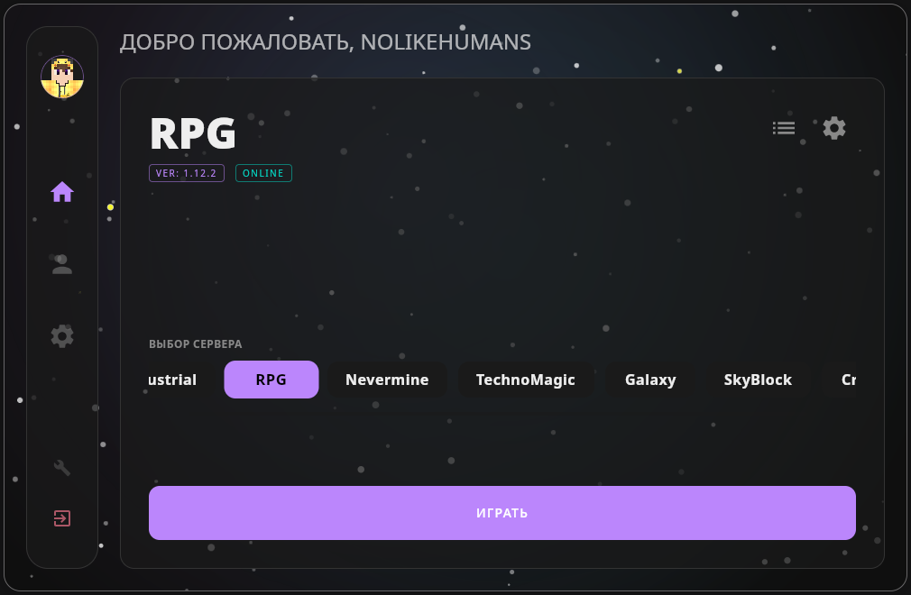
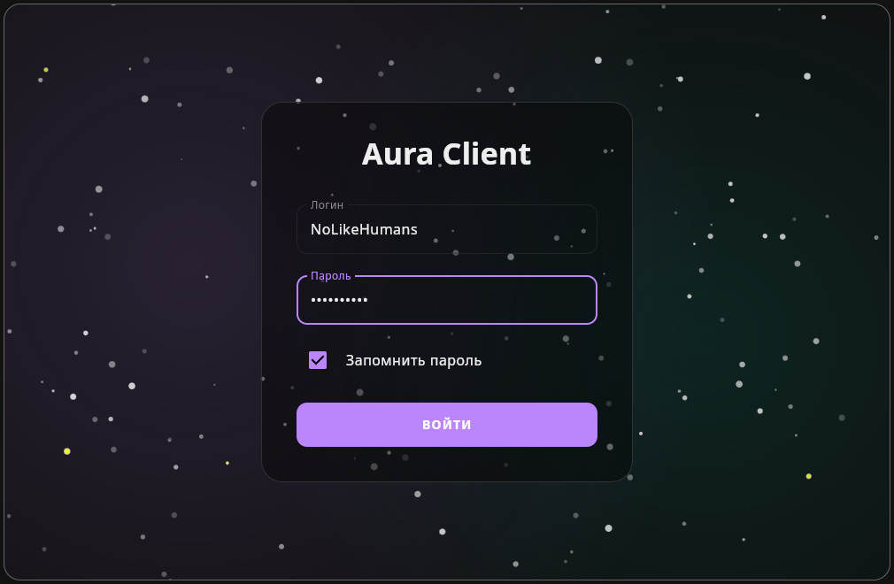
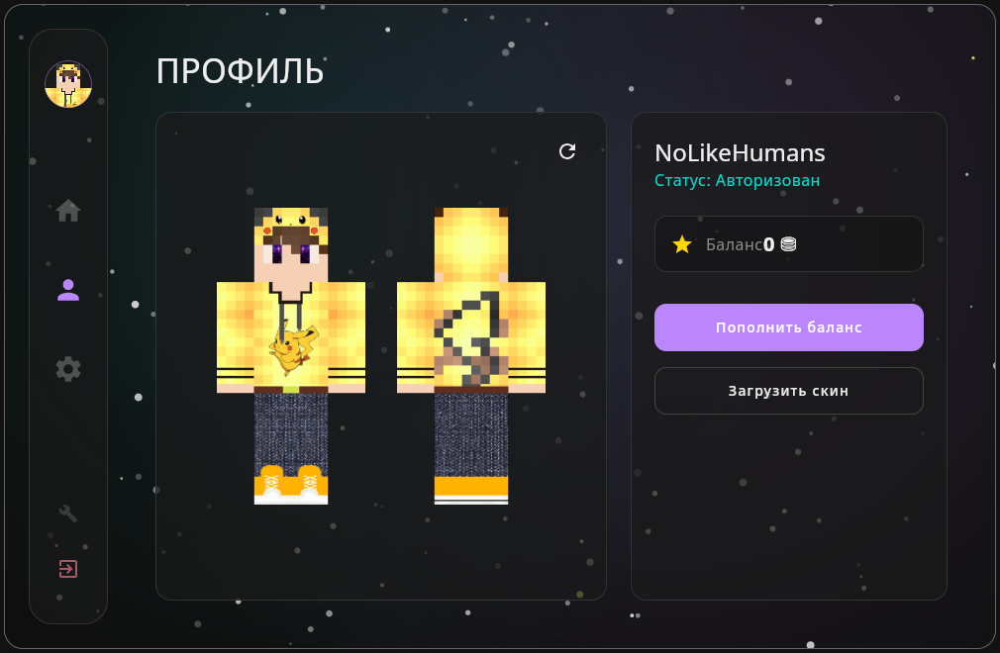
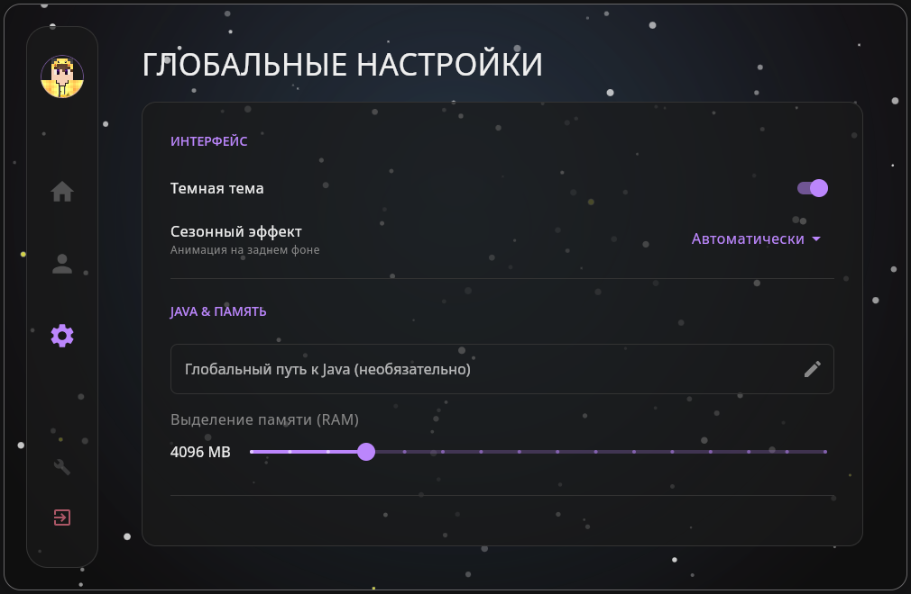
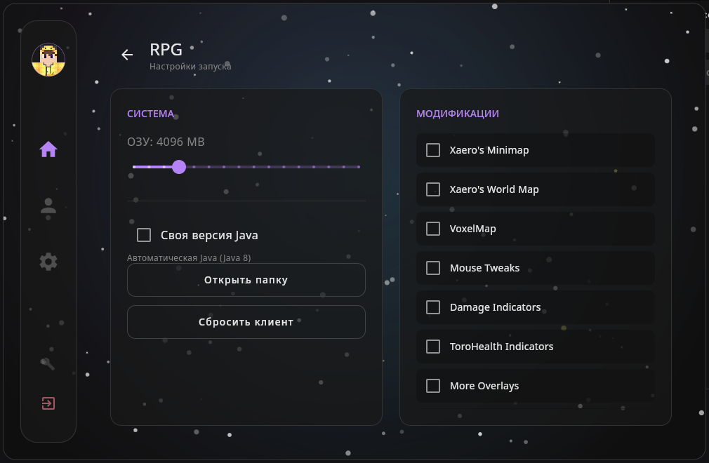

# Aura Launcher (Unofficial)

> **Неофициальный** лаунчер для проекта [SmartyCraft](https://smartycraft.ru).
> Создан как легкая, быстрая и открытая альтернатива официальному клиенту.

**Aura Launcher** — это современный клиент, написанный с нуля на **Kotlin** с использованием **Compose Multiplatform**.
В отличие от оригинала, он не требует старой Java, работает мгновенно и поддерживает нативный запуск на Linux и macOS без костылей.

<p align="center">
  
</p>

## Галерея

### Авторизация и Профиль
| Вход в аккаунт | Профиль игрока |
|:---:|:---:|
|  |  |

### Настройки
| Настройки лаунчера | Настройки клиента |
|:---:|:---:|
|  |  |

---

## Особенности

* **Только SmartyCraft:** Лаунчер преднастроен для работы исключительно с серверами проекта SmartyCraft.
* **Linux First:** Полноценная поддержка Linux. AppImage запускается сразу, без танцев с бубном и установки Java 8 вручную.
* **Производительность:** Написан на современном стеке (Compose Desktop). Потребляет меньше ресурсов, запускается за секунду.
* **Кроссплатформенность:**
    * **Windows** (.msi установщик, Portable .zip)
    * **Linux** (AppImage, .deb, .rpm)
    * **macOS** (.dmg, поддержка Apple Silicon)
* **Open Source:** Исходный код полностью открыт (GPLv3). Вы видите, что запускаете на своем компьютере.

## Установка

Все готовые сборки можно найти в разделе **[Releases](../../releases)**.

### Linux
* **AppImage:** Самый простой вариант. Скачайте, сделайте файл исполняемым (`chmod +x AuraLauncher.AppImage`) и запускайте.
* **DEB:** Для Ubuntu/Debian/Mint.
* **RPM:** Для Fedora/RedHat/OpenSUSE.

### Windows
* Скачайте и запустите `.msi` установщик.
* Лаунчер сам подтянет нужную Java для игры. Вам ничего настраивать не нужно.

### macOS
* Скачайте `.dmg` образ.
* Перетащите приложение в папку `Applications`.

## Сборка из исходников

Для сборки требуется **JDK 21**.

1.  Клонируйте репозиторий:
    ```bash
    git clone https://github.com/Kitty-Hivens/Aura-Launcher.git
    cd Aura-Launcher
    ```

2.  Запустите сборку для вашей ОС:
    * **Linux / macOS:**
        ```bash
        ./gradlew :client-ui:packageDistribution
        ```
    * **Windows:**
        ```bash
        gradlew.bat :client-ui:packageDistribution
        ```

3.  Готовые файлы будут находиться в папке:
    `client-ui/build/compose/binaries/main/`

## Дисклеймер

Этот проект является **неофициальным** программным обеспечением. Разработчик Aura Launcher никак не связан с администрацией SmartyCraft.
Все права на контент серверов, моды и торговые марки принадлежат их законным владельцам.

## Лицензия

Проект распространяется под лицензией **GNU GPL v3**.
Это гарантирует, что программа (и любые её модификации) всегда будет оставаться свободной и с открытым исходным кодом.
